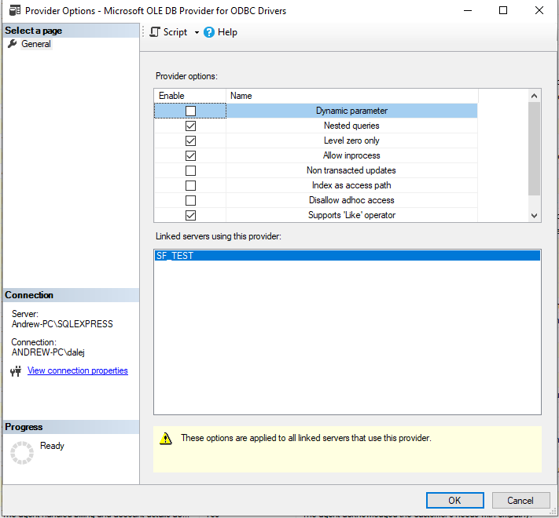

# MS SQL

## Local Connection Strings:
- Connection String: Server=localhost\SQLEXPRESS;Database=master;Trusted_Connection=True;
- SQL Server Install Log Folder: C:\Program Files\Microsoft SQL Server\160\Setup Bootstrap\Log\20240727_141605
- Installation Media Folder: C:\SQL2022\Express_ENU
- Intallation Resources Folder: C:\Program Files\Microsoft SQL Server\160\SSEI\Resources

INSTANCE NAME: SQLEXPRESS
SQL ADMINISTRATORS: ANDREW-PC\dalej
VERSION: 16.0.1000.6, RTM

# Snowflake Connection
## Perplexity Info
https://www.perplexity.ai/search/help-me-install-the-free-devel-Sg_vj6ZYR_GsEQ4.dkgMfw

## SF Data Types: https://docs.snowflake.com/en/sql-reference/intro-summary-data-types

## What I did:
- Landing Page: https://docs.snowflake.com/en/developer-guide/odbc/odbc
- 1) Started installing ODBC Drivers
    Confirm System Requirements:
        https://docs.snowflake.com/en/developer-guide/odbc/odbc-windows
        
- 2) Setup ODBC connections on windows (see video as well)
    https://stackoverflow.com/questions/5130486/how-do-i-create-a-system-dsn
    https://docs.snowflake.com/en/developer-guide/odbc/odbc-parameters#label-odbc-connection-parameters-required

- 3) Install SQL Server (Express or Dev) and SSMS

- 4) Change setting on Linked Servers => Providers => MSDASQL to:

- 5) Setup a Linked Server
    - Use the System DNS you setup and snowflake login credentials.

- 6) Right-click on the new linked server and try "test connection"

- 7) Try an open query statement to test pulling down data.
** Note: SQL Server does not like some data types of Snowflakes. So queries using them may through an error. **

Code Example:
SELECT * FROM OPENQUERY(SF_TEST, 'select top 100 ID from MY_DB.PUBLIC.TEST_DATA_SET');

## Tutorial Video 
https://www.youtube.com/watch?v=xO1KEw3vWHA